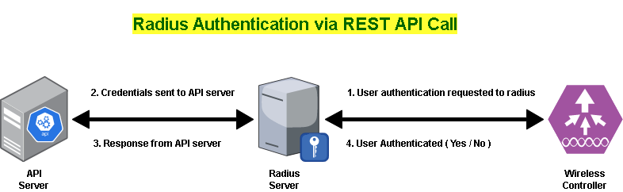
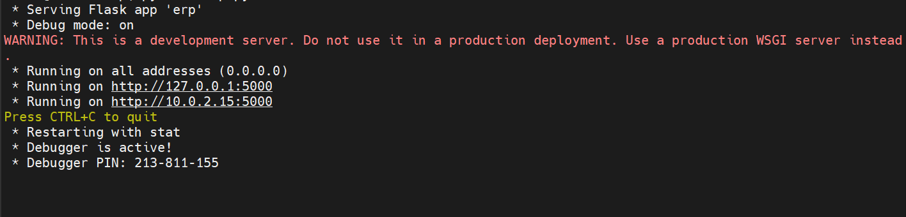
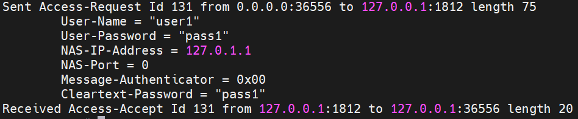
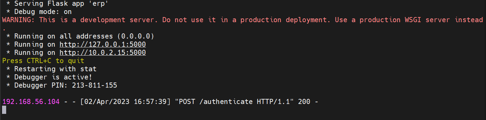
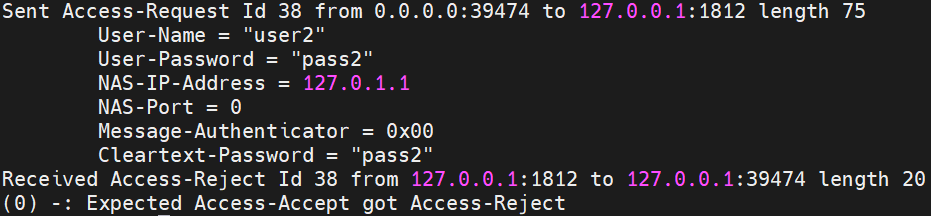
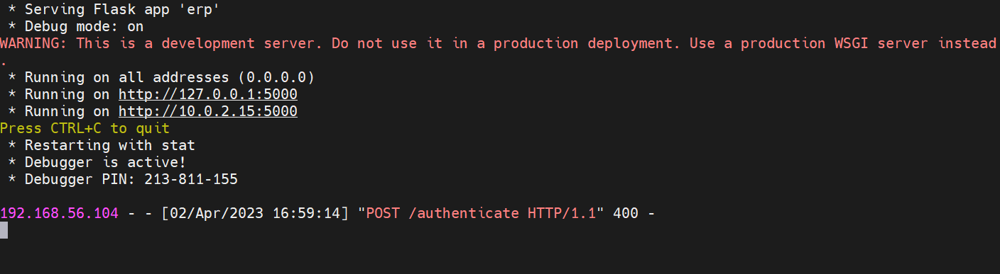

# Radius Authentication using REST API Call
In this lab environments, we will configure a radius server which will authenticate user not by himself but making API call to a server. Based on the response from API server radius will authenticate or not that user. Use case scenario might be that If we have user list database in our application backend then we can leverage this to verify user and authenticate. Because of AAA server capabilities, we can also extend this to manage authorization and account related operation but here we will only work on remote user authentication.

# Requirements:
  **VM1: Radius Server (192.168.56.104/24)**\
  **VM2: API Server (192.168.56.106/24)**
  
# Scenario:
Network Access Server (NAS) is a device that provides an access point to the network for remote users connecting using SLIP, PPP, or any other remote access protocol. The NAS transmits the information provided in the connection request from the remote user to the RADIUS server. Here wireless controller act as NAS server. Then RADIUS server checks this information against the user and returns to the NAS an authentication, authorization or denial for the remote user connection. \
The RADIUS server **(192.168.56.104)** checks user information against the entry for the remote user in various methods. It can use local or remote mysql database, LDAP, Active Directory etc. But in this scenario radius server will not authenticate remote user by himself but relay this information to a server **(192.168.56.106)** via REST API call. Then the API server will verify the user credential and give response to the radius server. On the basis of API response from the server radius will allow or deny the user accordingly.



# Environment Setup:
We will use Ubuntu 22.04.2 LTS for lab setup. FreeRADIUS is a modular, high performance free RADIUS application which is absolutely free. We will use it as radius server deployment. It will be deployed under an Ubuntu VM for which the IP address is **192.168.56.104** . Also, for emulating API server functionality, we will use Python and Flask module. That will be configured on another VM with IP address of **192.168.56.104** .

# API Server Configuration:
For API server functionality we will use a python script where Flask is used to for emulation API endpoint where radius will communicate through API call with user credentials. Then Server will verify this credentials with its own internal mechanism. it can verify user with backend user database query. Here, we will hardcode only one user information into script for simplicity. I think it will fulfill the purpose of this experiment. We will create a python script called **erp.py** .

### erp.py

```
from flask import Flask, request, jsonify, Response

app = Flask(__name__)

@app.route('/authenticate', methods=['POST'])
def authenticate_user():
    data = request.get_json()
    username = data['username']
    password = data['password']
    # Hardcoded authentication logic
    if username == 'user1' and password == 'pass1':
        authenticated = "ok"
        response = {'authenticated': authenticated}
        return jsonify(response)

    else:
        return Response(
        "Authentication Not Allowed!",
        status=400,
    )

if __name__ == '__main__':
    app.run(host='0.0.0.0', port=5000, debug=True)

```
It is a simple script that will listen on 5000 port while running. It accepts API request on URI **/authenticate** . When Radius will receive user authentication request from wireless controller, it will send that user information as JSON data onto API end point. Then API server will verify this information. If user information is correct then it will response HTTP 200 means allow. Otherwise it will deny by sending HTTP 400 response. Based on reply from API server, radius will allow or deny the user request.

### Running API Script:

execute erp.py

```bash
  python3 erp.py
```


Now, we will keep this script running and configure radius server.

# API Server Configurstion:
In radius server VM, we will install and configure FreeRADIUS software. For this we need to install some packages. 

### Install FreeRADIUS:

To install FreeRADIUS, run the following command:

```bash
  apt install freeradius freeradius-rest freeradius-utils
```
### Configure FreeRADIUS:

Once FreeRADIUS is installed, we need to configure it. The main configuration file for FreeRADIUS is /etc/freeradius/clients.conf. We need to configure the client section to allow requests from NAS (wireless controller) server's IP address. For this example, we will add the following lines to the files:

### /etc/freeradius/3.0/clients.conf
```bash
  client erp_server {
  ipaddr = 192.168.56.101
  secret = mysecret
}
```

To enable REST based authentication method:

### /etc/freeradius/3.0/users
```bash
DEFAULT Auth-Type := rest
```
To make REST based authentication default:

### /etc/freeradius/3.0/sites-enabled/default
```bash
authenticate {
     Auth-Type rest {
        rest
     }
```

Now configure REST auth mechanism:

```bash
ln -s /etc/freeradius/3.0/mods-available/rest /etc/freeradius/3.0/mods-enabled/
```
### /etc/freeradius/3.0/mods-enabled/rest
```bash
connect_uri = "http://192.168.56.106:5000"

authenticate {
                    uri = "${..connect_uri}/authenticate"
                    method = "post"
                    request_headers {
                      Content-Type = "application/json"
                      Authorization = "Bearer my-hardcoded-token"
                    }
                    body = json
                    data = '{ "username": "%{User-Name}", "password": "%{User-Password}" }'
                    force_to = json
                    #response_expected = "ok"
                    #response_if_not_found = "fail"

        }
```
We can enable user auth log status: 

### /etc/freeradius/3.0/radiusd.conf
```bash
auth = yes
```
Our FreeRADIUS server configuration is now compleated. Now start and enable the service:

```bash
systemctl --now enable freeradius.service
```
### Testing:
***radtest*** is a tool that comes with freeradius-utils package. We can use this tools to check radius server functionality from localhost. In our python script, we have hardcoded one user and password for demo purpose. Test radius authentication with below command:

```bash
radtest user1 pass1 localhost 0 testing123
```
Now check the output from radius and API server:




We can see user authentication status is ***Received Access-Accept***. it means user is successfully authenticated. Also, from API server, it received the API request and response with 200 OK status because user credentials is valid.

if we try to authenticate with incorrect user information:

```bash
radtest user2 pass2 localhost 0 testing123
```




From this output we can verify that our radius server is working properly.

### Security Enhancement:
We have configured out API communication with HTTP. We can easily configure TLS encryption or HTTPS during radius REST authentication configuration. Also, we can use secret token base authentication with API communication. We can secure NAS to radius communication by using various protocol like EAP-TLS, PEAP-MSCHAPv2, EAP-TTLS/PAP etc.

# References

[Wiki - FreeRADIUS](https://wiki.freeradius.org/Home)

[ FreeRADIUS rlm_rest Module](https://networkradius.com/doc/current/raddb/mods-available/rest.html)

[FreeRADIUS security](https://blog.tom.be/server-management/authenticating-your-wifi-against-a-rest-api-through-radius/)

[Another REST-API-FreeRADIUS Project](https://github.com/fgsants/REST-API-FreeRADIUS)

